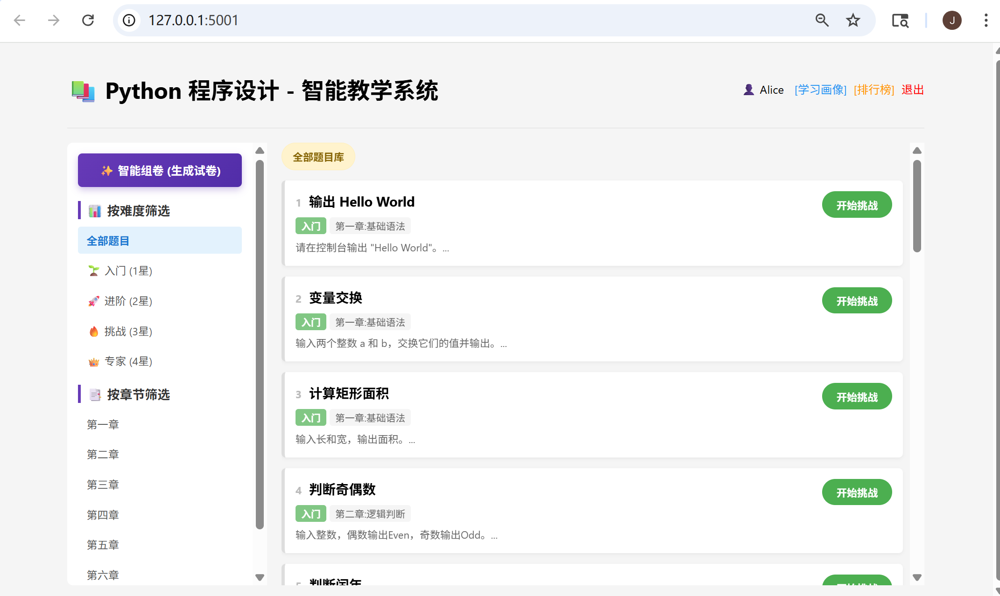
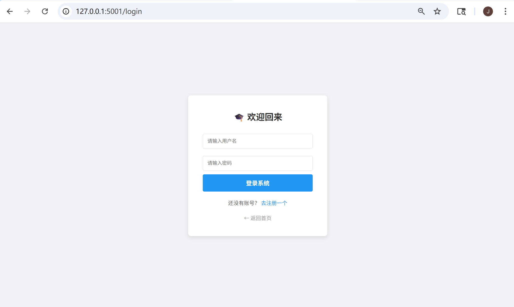
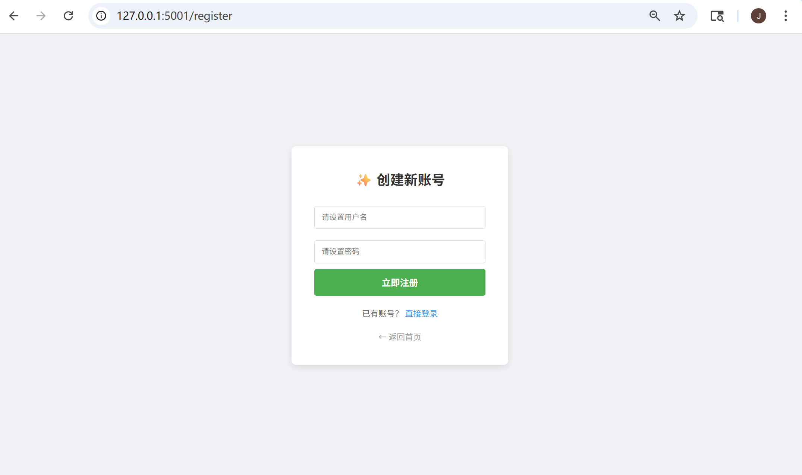
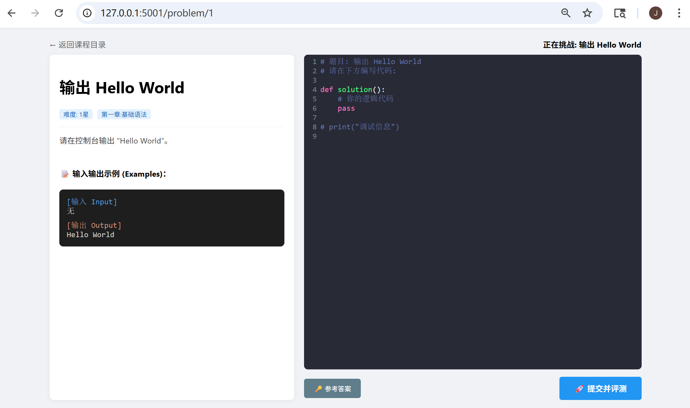
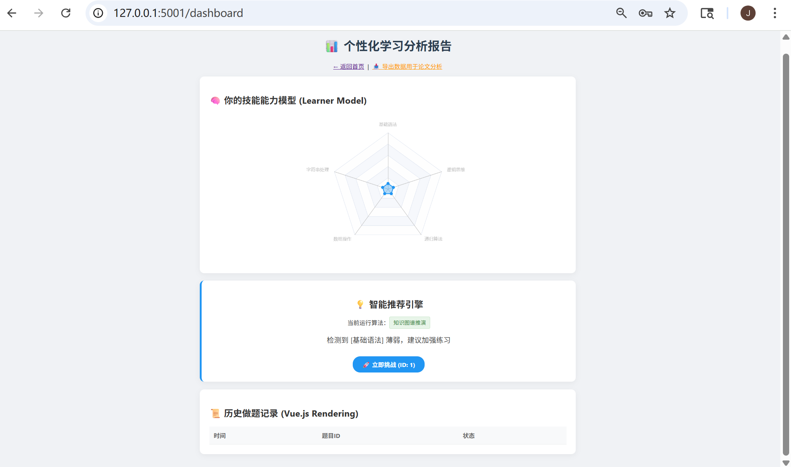

# Personalized Recommendation and Guidance System for Programming Courses
## 面向程序设计课程的个性化推荐与指导系统

## Project Overview
This project is a Flask-based teaching support platform designed for programming courses. It integrates core functionalities such as user registration and login, problem display and filtering, random quiz generation, code submission, learning-record tracking, learner-profile visualization, leaderboard display, and data export. The current version further extends the original prototype with an explainable recommendation mechanism, recommendation-evidence recording, recommendation-effect tracking, and a feedback-loop optimization process. In addition, the recommendation module now explicitly marks whether the evidence behind a recommendation is sufficient, whether follow-up samples are enough to validate it, and whether the system should temporarily avoid making a strong recommendation claim.

本项目是一个基于 Flask 开发的面向程序设计课程的教学支持平台。系统集成了用户注册与登录、题目展示与筛选、随机组卷、代码提交、学习记录追踪、学习画像可视化、排行榜展示以及数据导出等核心功能。在原有原型基础上，当前版本进一步补充了解释型推荐、推荐依据记录、推荐效果追踪与反馈闭环优化机制。除记录“为什么推荐”之外，系统现在还会明确标注“当前证据是否充分”“后续验证样本是否足够”，当数据不足时不会把推荐说得过于确定，从而更真实地回答“推荐准不准”这一问题。

---
## System Interface Preview / 系统界面展示

The following UI descriptions are updated according to the latest real screenshots provided during the thesis-preparation workflow. They emphasize the recommendation-evidence panel, recommendation-feedback interaction, AST result feedback, and the dashboard’s recommendation-tracking view.  
以下界面说明已根据最近一次论文整理过程中提供的真实运行截图更新，重点突出推荐依据面板、推荐反馈交互、AST 评测结果反馈以及学习画像页中的推荐追踪视图。

### Home Page / 首页
The home page provides the main entrance to the system, including problem browsing, chapter-based filtering, difficulty-based filtering, and random quiz generation.  
首页提供系统的主要入口，包括题目浏览、按章节筛选、按难度筛选以及随机组卷等功能。



### Login Page / 登录页
The login page supports user authentication and serves as the main access point for registered users.  
登录页用于实现用户身份认证，是已注册用户进入系统的主要入口。



### Registration Page / 注册页
The registration page allows new users to create accounts and enter the learning platform.  
注册页用于新用户创建账号并进入学习平台。



### Problem-Solving Page / 做题页
The problem-solving page is now one of the most thesis-relevant interfaces in the project. In the latest screenshots, it simultaneously shows the problem statement, example I/O, code editor, recommendation source, weak knowledge point, generated rationale, diagnostic summary, current recommendation-accuracy score, and the student-feedback panel used to judge whether the recommendation is actually appropriate. After submission, the same page also displays AST-based analysis, error type, runtime, memory estimate, learning duration, and case-by-case simulated evaluation results.  
做题页是当前项目中最适合用于论文展示的核心界面之一。根据最新截图，该页面同时展示题目描述、输入输出示例、代码编辑区、推荐来源、薄弱知识点、生成依据、诊断摘要、当前推荐准确度，以及用于判断“这次推荐准不准”的学生反馈区。提交代码后，同一页面还会展示基于 AST 的分析结果、错误类型、运行时间、内存估计、学习时长和模拟测试用例结果。

**Observed screenshot highlights / 截图中可直接看到的内容：**
- recommended problem banner with recommendation source and time；
- 题目来自系统推荐的提示卡片；
- feedback buttons for “匹配度 / 帮助度” plus a free-text note area；
- 用于填写“匹配度 / 帮助度”的按钮组和补充说明输入框；
- post-submission AST report and simulated judging result panel；
- 提交后的 AST 静态分析报告与评测结果区。



### Learner Dashboard / 学习画像页
The learner dashboard is no longer just a radar-chart page. Based on the latest screenshots, it contains a learning overview card, a skill radar chart, the current recommendation card, recommendation rationale and weak-skill mapping, a recommendation-accuracy summary section, a recommendation-effect tracking table, and an enriched learning-log table with recommendation-loop fields. This makes the dashboard directly usable for thesis screenshots and later data interpretation.  
学习画像页已经不再只是简单的能力雷达图页面。结合最新截图可以看到，该页面包含学习概览卡片、技能雷达图、当前推荐卡片、推荐依据与薄弱项映射、推荐准确度综合判断区、推荐效果追踪表，以及包含推荐闭环字段的学习日志表，因此非常适合作为论文中的系统截图与分析素材。

**Observed screenshot highlights / 截图中可直接看到的内容：**
- recommendation summary cards such as total recommendations, validated recommendations, and average recommendation accuracy；
- “累计推荐次数 / 已验证推荐次数 / 平均推荐准确度”等概览卡片；
- evidence-to-weakness mapping table for each knowledge point；
- 各知识点的推荐依据与薄弱项映射表；
- recommendation tracking records with confidence scores, pre/post metrics, and student feedback placeholders；
- 带有依据置信度、推荐前后变化、学生反馈占位信息的追踪记录表；
- learning-log table prepared for thesis-oriented export and case analysis。
- 面向论文数据导出与案例分析的学习日志表。



### Screenshot Scenarios Used in the README / 本次 README 采用的截图场景

To better align the documentation with the actual interface shown in your screenshots, this README now treats the visual presentation as five concrete usage scenarios instead of only two generic page types:  
为了让文档更贴近你提供的实际页面截图，README 现在把展示内容按 5 个具体使用场景来理解，而不只是笼统地写成“做题页”和“画像页”两类页面：

1. **Recommended problem page before submission / 推荐题做题页（提交前）**  
   Shows recommendation source, weak knowledge point, rationale, diagnostic summary, and current recommendation-accuracy state.

2. **Recommended problem page after submission / 推荐题做题页（提交后）**  
   Shows AST analysis, pass rate, runtime, memory estimate, learning duration, and case results after code submission.

3. **Dashboard overview / 学习画像总览**  
   Shows learning overview, skill radar chart, current recommendation card, and recommendation-accuracy summary cards.

4. **Dashboard evidence mapping / 推荐依据与薄弱项映射**  
   Shows knowledge-point attempts, accuracy, average time, historical difficulty, and high-frequency errors.

5. **Dashboard tracking view / 推荐效果与准确度追踪视图**  
   Shows recommendation history, confidence scores, pre/post metrics, student feedback placeholders, and enriched learning logs.


## Project Highlights / 项目亮点

### 1. Teaching-Oriented System Design / 面向教学场景的系统设计
This project is designed specifically for programming-course practice rather than for general online judging or commercial recommendation scenarios. It focuses on teaching support, learner tracking, and process-oriented guidance.  
本项目面向程序设计课程练习场景构建，而不是通用在线评测或商业推荐场景，重点在于教学支持、学习过程留痕与面向过程的指导。

### 2. Learning-Log Driven Support / 基于学习日志的支持机制
The system records user submissions, problem information, status, timestamps, completion duration, error types, recommendation source, and recommendation status in the database, making it possible to trace learning processes rather than only storing static results.  
系统将用户提交记录、题目信息、状态、时间戳、完成时长、错误类型、推荐来源与推荐状态等数据保存到数据库中，使学习过程能够被持续追踪，而不仅仅是保存静态结果。

### 3. Explainable Recommendation and Evidence Recording / 可解释推荐与依据记录
The current version no longer stops at generating a recommendation result. Instead, it records the weak knowledge point, historical accuracy, average completion time, historical high-frequency error types, and matched problem difficulty as the basis for recommendation generation.  
当前版本不再停留于“给出推荐结果”，而是同步记录薄弱知识点、历史正确率、平均完成时间、历史高频错误类型以及匹配题目难度等信息，作为推荐生成依据。

### 4. Recommendation Feedback Loop / 推荐反馈闭环
The system continuously tracks correctness before and after recommendation, completion time, error-type changes, and later same-type problem performance, then uses the observed effect to adjust subsequent recommendation rules and difficulty.  
系统能够持续追踪推荐前后的正确率、完成时间、错误类型变化以及后续同类题表现，并根据观测到的效果动态调整后续推荐规则和难度，形成反馈闭环。

### 5. Conservative Accuracy Validation / 保守型准确度校验
The system does not treat every recommendation as "accurate" by default. It now distinguishes between evidence sufficiency, pending validation, and validated recommendations, and shows when the system still needs more learning samples before making a reliable judgment.  
系统不会默认把每一次推荐都视为“准确”。当前版本新增了“证据不足—待验证—已验证”的区分逻辑，并会明确提示何时仍需更多学习样本后才能对推荐准确性做出可靠判断。

### 6. AST-Assisted Code Analysis / AST 辅助代码分析
The project introduces Python AST-based code structure analysis to extract simple structural features from submitted code and support error classification and feedback generation.  
项目引入基于 Python AST 的代码结构分析方法，对提交代码提取简单结构特征，并用于辅助错误分类与反馈生成。

### 7. Integrated Graduation Project Prototype / 一体化毕业设计原型
The repository demonstrates an integrated prototype that combines backend development, database design, web interaction, learner analytics, and academic-oriented system presentation.  
本仓库展示的是一个集后端开发、数据库设计、Web 交互、学习分析与学术展示于一体的毕业设计原型。


## Background and Motivation
Programming courses are highly practice-oriented. Traditional exercise platforms often focus on static problem display and basic submission functions, while providing limited support for learner differentiation, process tracking, and targeted feedback. To address this issue, this project attempts to build a teaching support system that combines problem organization, learning-log recording, learner modeling, code-structure analysis, and recommendation feedback-loop optimization in one integrated prototype.

程序设计课程具有较强的实践性和连续性。传统练习平台通常侧重于题目展示与基础提交功能，在学习差异识别、过程留痕和针对性反馈方面支持不足。针对这一问题，本项目尝试构建一个集题目组织、学习记录保存、学习画像展示、代码结构分析以及推荐反馈闭环优化于一体的教学支持系统原型。

---

## Core Functions
- User registration and login
- Problem display and filtering by difficulty and chapter
- Random quiz generation
- Code submission interface
- Learning-log recording
- Learner-profile visualization
- Leaderboard display
- Data export
- Explainable personalized recommendation based on weak knowledge points and historical records
- Recommendation-basis recording and recommendation-effect tracking
- Recommendation-rule adjustment based on recommendation outcomes
- AST-based code structure analysis and error-type classification

## 核心功能
- 用户注册与登录
- 题目展示与按难度、章节筛选
- 随机组卷
- 代码提交界面
- 学习记录保存
- 学习画像可视化
- 排行榜展示
- 数据导出
- 基于薄弱知识点与历史记录的可解释个性化推荐
- 推荐依据记录与推荐效果追踪
- 基于推荐结果的推荐规则调整
- 基于 AST 的代码结构分析与错误类型分类

---

## Recommendation Feedback Loop Design / 推荐反馈闭环设计

### 1. Recommendation Rationale Recording / 推荐依据记录
For each recommendation event, the system records:
- the student's current weak knowledge point,
- historical accuracy on related problems,
- average completion time,
- historical high-frequency error types,
- the matched difficulty level of the recommended problem,
- recommendation source and recommendation time.

对于每一次推荐事件，系统会记录：
- 学生当前的薄弱知识点；
- 相关题目的历史正确率；
- 平均完成时间；
- 历史高频错误类型；
- 推荐题目的匹配难度；
- 推荐来源与推荐时间。

### 2. Recommendation-Effect Tracking / 推荐效果追踪
After a recommendation is issued and completed, the system continues to track:
- correctness before and after recommendation,
- completion time before and after recommendation,
- changes in major error types,
- later performance on same-type problems,
- an effect score used to judge whether the recommendation was helpful.

当推荐发出并被学生完成后，系统会继续追踪：
- 推荐前后的正确率变化；
- 推荐前后的完成时间变化；
- 主要错误类型的变化；
- 后续同类题目的表现；
- 用于判断推荐是否有效的效果评分。

### 3. Accuracy Validation and Evidence Sufficiency / 准确度校验与证据充分性判断
The system adds explicit fields such as evidence level, validation status, follow-up sample size, and evaluation notes. If the user has not accumulated enough logs yet, or if there are not enough later same-type exercises after a recommendation, the recommendation will be marked as "insufficient evidence" or "keep observing" instead of being overclaimed as accurate.  
系统新增了证据等级、验证状态、后续样本数和评估说明等字段。当学生历史日志不足，或推荐之后尚未积累足够的同类题样本时，系统会把该次推荐标记为“证据不足”或“待继续观察”，而不是过早宣称推荐准确。

### 4. Closed-Loop Rule Adjustment / 闭环规则调整
The platform does not only observe recommendation effects; it also uses them to refine future recommendations. If past recommendations on the same knowledge point are less helpful, the system can lower the target difficulty and continue consolidation. If previous recommendations are helpful, it can maintain or moderately increase the difficulty.  
平台不仅观察推荐效果，还会利用这些效果反馈去修正后续推荐策略。如果同一知识点的前序推荐帮助较小，系统可以降低目标难度并继续巩固；如果前序推荐效果较好，则可以维持或适度提高难度。

### 5. Learning-Log Enhancement / 学习日志增强
The learning log now stores not only submission status but also recommendation source, recommendation time, completion state, completion duration, error type, effect change, and same-type follow-up performance. This provides a more direct basis for thesis statistics, charts, and case studies.  
当前学习日志除了提交状态外，还会记录推荐来源、推荐时间、完成状态、完成时长、错误类型、效果变化以及同类题后续表现，为论文中的统计分析、图表展示和案例研究提供更加直接的数据基础。

---

## System Features
1. **Teaching-oriented design**  
   The system is designed specifically for programming-course practice scenarios rather than for general online judging or commercial recommendation applications.

2. **Learning-log driven analysis**  
   Student interaction data, including submission records, recommendation metadata, duration, and error information, are stored in the database and used as the basis for learner modeling and feedback generation.

3. **Explainable recommendation mechanism**  
   Recommendations are generated together with traceable rationale, including weak knowledge points, historical correctness, error characteristics, and matched difficulty.

4. **Recommendation-effect evaluation**  
   The system evaluates whether recommendations are helpful by comparing learning indicators before and after recommendation and by observing later same-type problem performance.

5. **AST-assisted feedback mechanism**  
   The system introduces Python AST-based code structure analysis to extract simple structural features from submitted code and support learning guidance.

## 系统特点
1. **面向教学场景设计**  
   系统面向程序设计课程练习场景构建，而不是通用在线评测平台或商业推荐平台。

2. **基于学习日志的数据分析**  
   系统将学生的提交记录、推荐元数据、完成时长与错误信息存入数据库，并以此作为学习画像与反馈生成的基础。

3. **可解释推荐机制**  
   推荐结果会同步附带可追踪的生成依据，包括薄弱知识点、历史正确率、错误特征和匹配难度。

4. **推荐效果评估机制**  
   系统通过比较推荐前后学习指标，并观察后续同类题表现，判断推荐是否真正产生帮助。

5. **AST 辅助反馈机制**  
   系统引入 Python AST 代码结构分析方法，对提交代码进行简单结构特征提取，用于辅助学习指导。

---

## Data Recorded for Thesis Analysis / 论文分析可用数据
The current prototype can provide the following analyzable data for thesis writing:
- recommendation source, recommendation time, and recommendation status;
- weak knowledge-point labels and matched problem difficulty;
- evidence level, validation status, and follow-up sample size;
- correctness, completion time, and error-type changes before/after recommendation;
- same-type follow-up performance after recommendation;
- enriched learning logs for case analysis and CSV export.

当前原型可以为论文写作提供以下可分析数据：
- 推荐来源、推荐时间与推荐状态；
- 薄弱知识点标签及匹配题目难度；
- 证据等级、验证状态与后续样本数；
- 推荐前后正确率、完成时间与错误类型变化；
- 推荐后的同类题后续表现；
- 可用于案例分析与 CSV 导出的增强型学习日志。

---

## Tech Stack
- **Backend:** Python, Flask
- **Database:** SQLite3
- **Frontend:** HTML, Template Rendering, Vue.js, ECharts
- **Data Support:** Learning Logs + Recommendation Events
- **Analysis Method:** AST-based Code Structure Analysis, Rule-Based Recommendation, Feedback Tracking
- **Version Control:** Git, GitHub

## 技术栈
- **后端：** Python、Flask
- **数据库：** SQLite3
- **前端：** HTML、模板渲染、Vue.js、ECharts
- **数据基础：** 学习日志 + 推荐事件记录
- **分析方法：** 基于 AST 的代码结构分析、规则型推荐、反馈追踪
- **版本管理：** Git、GitHub

---
## Future Work / 后续工作

- Improve the automatic judging mechanism with more rigorous execution and verification strategies  
- Introduce richer behavioral features to optimize recommendation precision  
- Add more rigorous effect-evaluation methods and longitudinal learning analytics  
- Strengthen database constraints and improve data consistency  
- Enhance interface design and interaction experience  
- Extend the system toward more complete programming-course teaching support scenarios  

- 引入更加严格的自动评测与验证机制  
- 融入更丰富的学习行为特征以优化推荐精度  
- 增加更严谨的效果评估方法与纵向学习分析  
- 强化数据库约束设计，提升数据一致性  
- 优化界面设计与交互体验  
- 将系统进一步扩展到更完整的程序设计课程教学支持场景

---

## Academic Use / 学术用途

This repository is intended for undergraduate graduation-project presentation, thesis support, and academic demonstration. It reflects the current prototype implementation of the project and is not positioned as a production-level industrial system. Its emphasis lies in educational support, recommendation interpretability, process traceability, and recommendation-effect analysis rather than in large-scale production deployment.  
本仓库主要用于本科毕业设计展示、论文写作支持和学术演示，展示的是项目当前原型实现版本，并不定位为生产级工业系统。其重点在于教学支持、推荐可解释性、学习过程留痕与推荐效果分析，而非大规模生产部署。

---

## Project Structure
```text
MyGradProject/
├── app.py
├── mock_data.py
├── system.db
├── assets/
│   ├── dashboard.png
│   ├── home.png
│   ├── login.png
│   ├── register.png
│   └── solve.png
└── templates/
    ├── dashboard.html
    ├── index.html
    ├── leaderboard.html
    ├── login.html
    ├── register.html
    └── solve.html
```

## Notes for Thesis Writing / 论文撰写建议
When describing this system in a thesis, it is more appropriate to present it as:
- an educational support prototype for programming courses,
- an explainable recommendation and guidance system,
- a learning-log driven recommendation-feedback-loop prototype,
- a graduation-project system integrating web development, learner analytics, and recommendation evaluation.

在论文描述中，更适合将本系统表述为：
- 面向程序设计课程的教学支持原型；
- 具有可解释推荐能力的学习指导系统；
- 基于学习日志的推荐反馈闭环原型；
- 集 Web 开发、学习分析与推荐评估于一体的毕业设计系统。
